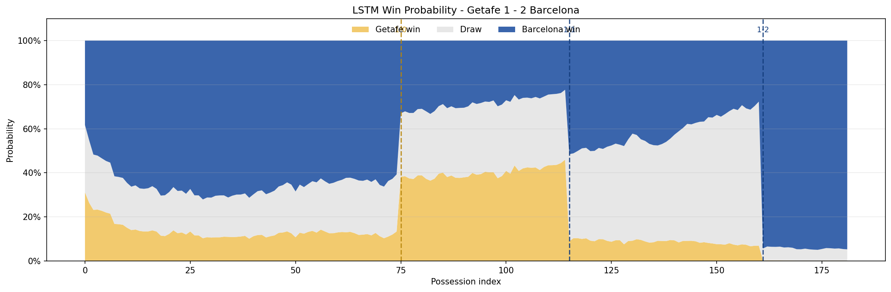
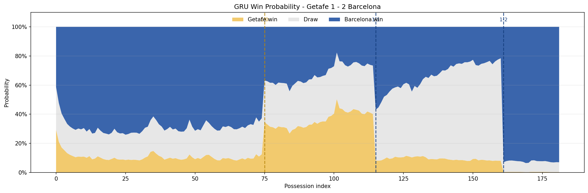
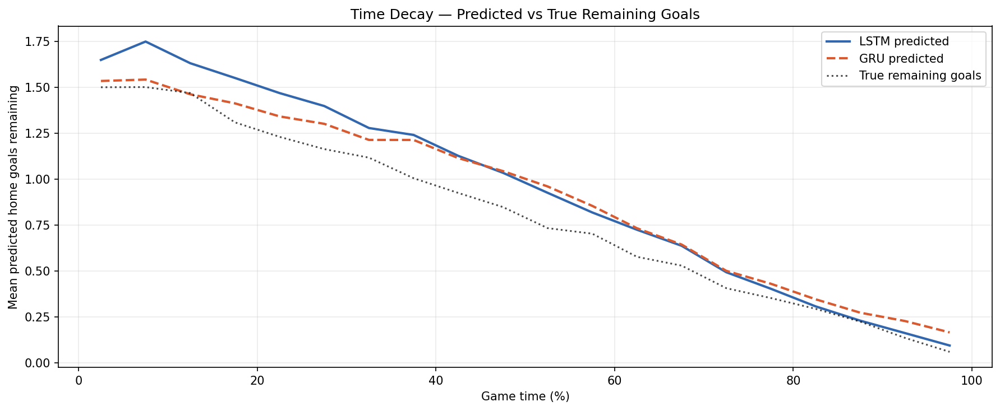

# Dynamic Win Probability — La Liga

> Predicting in-game win probabilities from possession-level event sequences using deep learning, inspired by [Robberechts et al. (KDD 2021)](https://arxiv.org/abs/2012.07669).

---

## What this project does

Most win probability models update once per goal. This one updates **every possession** — using the full sequence of passes, carries, shots, and dribbles within each possession to predict how many goals each team will score from that moment forward. Those remaining-goal predictions are then converted into home win / draw / away win probabilities using a Poisson model.

Trained and evaluated on **793 La Liga matches** from StatsBomb open data, enriched with Club Elo ratings and expected goals (xG). The match-level train/val/test split (70/15/15) ensures no possession from the same match appears in both train and test, preventing data leakage from game state continuity.

---

## Results

| Metric | RF Baseline | LSTM | GRU |
|---|---|---|---|
| Remaining-goals MAE | 0.7677 | 0.6639 | **0.6552** |
| RPS ↓ | 0.1377 | 0.1075 | **0.1056** |
| Multiclass Brier ↓ | 0.4488 | 0.3592 | **0.3539** |

Both LSTM and GRU beat the baseline by **~23% on RPS**. GRU edges LSTM on all three primary metrics — fewer parameters, slightly less overfitting on a dataset of this size.

### Calibration (ECE — lower is better)

| Outcome | LSTM | GRU |
|---|---|---|
| Home win | 0.0319 | 0.0398 |
| Draw | 0.0484 | 0.0456 |
| Away win | 0.0263 | 0.0330 |

All ECE values sit below 0.05 — well-calibrated across all three outcomes. Draw calibration is the weakest for both models, which is expected: the Poisson independence assumption tends to underestimate draw probability in close matches. A Dixon-Coles correction would partially address this and is a natural direction for future work.

### What the models actually learned

**Goal discrimination** — when a home goal is genuinely still coming, both models predict 2.2× more than when there isn't one. For away goals the ratio is 1.8×. Home goals are discriminated more strongly, reflecting La Liga's real home advantage in the data.

**Time decay** — predicted remaining goals drop from ~1.46 at kickoff to ~0.24 in the 85th minute (6× reduction), closely tracking actual remaining goals throughout. Both models have genuinely learned that time matters — not just that more goals happen early, but by how much and at what rate.

**LSTM vs GRU in practice** — LSTM produces smoother probability curves, better suited for full-time outcome prediction. GRU is more reactive to in-game events, with visible probability shifts around goals and periods of sustained pressure — better suited for live match tracking where capturing momentum matters. Both models show slight overconfidence in the opening 20 minutes before enough match context has accumulated, a known behaviour of sequence models operating with limited early input.

### Win probability — sample match

| LSTM | GRU |
|---|---|
|  |  |

### Time decay — predicted vs true remaining goals



---

## Project structure

```
dl-win-probability/
├── notebooks/
│   ├── 01_data_collection.ipynb     # StatsBomb + Elo merge
│   ├── 02_preprocessing.ipynb       # Feature engineering, padding, scaling, splits
│   ├── 03_models.ipynb              # RF baseline, LSTM, GRU training
│   └── 04_evaluation.ipynb          # Calibration, comparison, win probability plots
├── src/
│   ├── features.py                  # engineer_features_future_goals, poisson_wdl_from_lambdas
│   ├── metrics.py                   # ranked_probability_score, multiclass_brier_score, ece
│   ├── models.py                    # build_lstm, build_gru
│   └── viz.py                       # plot_calibration, plot_combined_win_probability_with_goals
├── data/
│   ├── raw/                         # StatsBomb JSONs, EloRatings.csv (not tracked in git)
│   └── processed/                   # Generated by notebook 02 (not tracked in git)
├── models/                          # Saved .keras models (not tracked in git)
├── results/                         # Predictions and plots (not tracked in git)
└── requirements.txt
```

Notebooks are designed to run in order. Each one saves its outputs to disk so the next one can load them without rerunning anything.

---

## Quickstart

**1. Clone and install**
```bash
git clone https://github.com/yourusername/dl-win-probability.git
cd dl-win-probability
pip install -r requirements.txt
```

**2. Get the data**

StatsBomb open data:
```bash
git clone https://github.com/statsbomb/open-data.git
```

Copy the `matches/11/` and `events/` folders into `data/raw/`, along with `EloRatings.csv` from [Club Elo](http://clubelo.com/).

**3. Run notebooks in order**
```
01_data_collection   → ~10 mins
02_preprocessing     → ~5 mins
03_models            → ~15 mins
04_evaluation        → ~2 mins
```

---

## Model architecture

Both models share the same structure — only the recurrent layer changes.

```
Input (n_matches, 273 timesteps, 25 features)
  → Masking (mask_value=0.0)
  → LSTM / GRU (64 units, return_sequences=True)
  → Dropout (0.2)
  → Dense (32, relu)
  → Dense (2, softplus)          ← predicts [future_home_goals, future_away_goals]
```

**Loss:** `tf.keras.losses.Poisson()` — correct for count-valued remaining-goal targets.  
**Output activation:** `softplus` — ensures strictly positive Poisson rate estimates.  
**Training:** Adam (lr=0.001), EarlyStopping (patience=5, restore_best_weights=True).

Targets are converted to WDL probabilities at inference time by summing over remaining goal combinations under the Poisson distribution. The model is trained on La Liga only — generalisation to other leagues is an open question and a natural next step.

---

## Data

| Item | Value |
|---|---|
| Source | StatsBomb open data (La Liga) |
| Matches | 793 (868 raw, 75 dropped — score mismatch) |
| Possessions | ~154,000 |
| Raw events | ~3.1M |
| Features | 25 per possession timestep |
| Max sequence length | 273 possessions |
| Train / Val / Test | 555 / 119 / 119 matches (70/15/15) |

---
